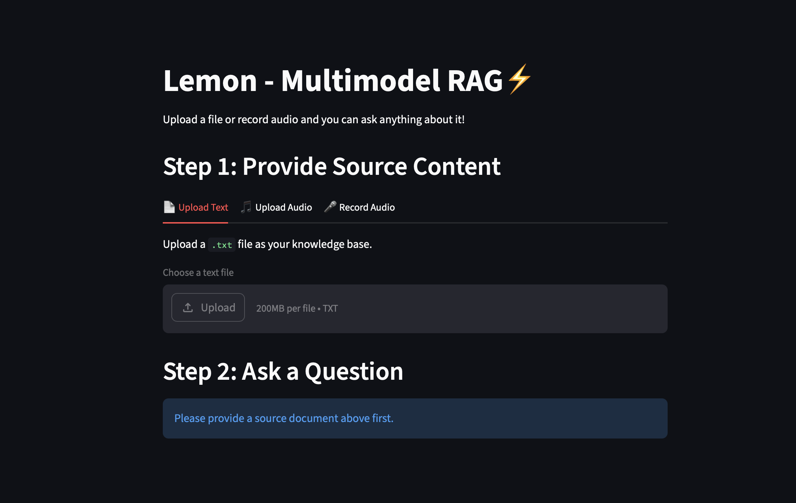

# 🍋 Lemon — Multimodal RAG ⚡

### 🌐 Live Demo
👉 https://l95qpj2cgxzqzrvpiqvxf6.streamlit.app/

A powerful **Multimodal Retrieval-Augmented Generation (RAG)** application built with **Streamlit**, **LangChain**, **FAISS**, **Whisper**, and **Groq LLMs**.

Lemon allows users to:

- 📄 Upload text documents
- 🎵 Upload audio files
- 🎤 Record live audio
- 🧠 Ask contextual questions from the uploaded content
- ⚡ Get blazing-fast AI-powered answers using RAG

---

# 🚀 Demo

## Features Overview

| Feature | Description |
|---|---|
| 📄 Text Upload | Upload `.txt` files as a knowledge base |
| 🎵 Audio Upload | Upload `.mp3`, `.wav`, `.m4a` files |
| 🎤 Live Recording | Record audio directly from browser |
| 📝 Speech-to-Text | Automatic transcription using Whisper |
| 🔍 Semantic Retrieval | FAISS vector similarity search |
| 🤖 LLM Answering | Context-aware responses via Groq |
| ⚡ Fast Embeddings | HuggingFace sentence-transformers |
| 🌙 Clean UI | Dark-themed responsive Streamlit interface |

---

# 🖼️ Application Preview


---

# 🏗️ Architecture

```text
                ┌────────────────────┐
                │  User Input        │
                │────────────────────│
                │ • Text File        │
                │ • Audio File       │
                │ • Live Recording   │
                └─────────┬──────────┘
                          │
                          ▼
                ┌────────────────────┐
                │ Whisper STT        │
                │ (Audio → Text)     │
                └─────────┬──────────┘
                          │
                          ▼
                ┌────────────────────┐
                │ Text Chunking      │
                │ LangChain Splitter │
                └─────────┬──────────┘
                          │
                          ▼
                ┌────────────────────┐
                │ Embeddings Model   │
                │ MiniLM-L6-v2       │
                └─────────┬──────────┘
                          │
                          ▼
                ┌────────────────────┐
                │ FAISS Vector DB    │
                └─────────┬──────────┘
                          │
                          ▼
                ┌────────────────────┐
                │ Similarity Search  │
                └─────────┬──────────┘
                          │
                          ▼
                ┌────────────────────┐
                │ Groq LLM           │
                │ Llama 3.3 70B      │
                └─────────┬──────────┘
                          │
                          ▼
                ┌────────────────────┐
                │ Final AI Response  │
                └────────────────────┘
```

---

# 🛠️ Tech Stack

## Frontend
- Streamlit

## AI / ML
- OpenAI Whisper
- LangChain
- FAISS
- HuggingFace Embeddings
- Groq LLM

## Models Used
- `sentence-transformers/all-MiniLM-L6-v2`
- `llama-3.3-70b-versatile`
- `Whisper Base`

---

# 📂 Project Structure

```text
LEMON/
│
├── __pycache__/              # Python cache files
├── data/                     # Sample Data
├── venv/                     # Virtual environment
│
├── .env                      # Environment variables
├── .envExample               # Example environment file
├── .gitignore                # Git ignored files
│
├── app.py                    # Main Streamlit application
├── rag.py                    # RAG pipeline logic
├── packages.txt              # System-level packages (for deployment)
├── requirements.txt          # Python dependencies
├── README.md                 # Project documentation
```

---

# 📄 File Descriptions

| File / Folder | Purpose |
|---|---|
| `app.py` | Main Streamlit frontend application |
| `rag.py` | Handles embeddings, vector search, retrieval, and LLM response generation |
| `requirements.txt` | Python libraries required for the project |
| `packages.txt` | OS/system packages needed during deployment |
| `.env` | Stores API keys and environment variables |
| `.envExample` | Template for environment configuration |
| `data/` | Sample Data |
| `venv/` | Python virtual environment |
| `README.md` | Project documentation |
| `__pycache__/` | Auto-generated Python cache files |

---

# ⚙️ Installation

## 1️⃣ Clone Repository

```bash
git clone https://github.com/cruzz77/MutiModel-RAG-
cd YOUR-PROJECT-REPO
```

---

## 2️⃣ Create Virtual Environment

### macOS/Linux

```bash
python3.12 -m venv venv
source venv/bin/activate
```

### Windows

```bash
python -m venv venv
venv\Scripts\activate
```

---

## 3️⃣ Install Dependencies

```bash
pip install -r requirements.txt
```

---

# 🔑 Environment Variables

Create a `.env` file:

```env
GROQ_API_KEY=your_groq_api_key_here
```

Get your API key from:
👉 https://console.groq.com/keys

---

# ▶️ Run Application

```bash
streamlit run app.py
```

Application will start at:

```text
http://localhost:8501
```

---

# 🧠 How It Works

## 📄 Text Flow

```text
TXT File
   ↓
Chunking
   ↓
Embeddings
   ↓
FAISS Storage
   ↓
Semantic Retrieval
   ↓
LLM Answer
```

---

## 🎵 Audio Flow

```text
Audio Input
   ↓
Whisper Transcription
   ↓
Text Processing
   ↓
RAG Pipeline
   ↓
Answer Generation
```

---

# 🔍 RAG Pipeline

## 1. Document Creation

```python
documents = [Document(page_content=text)]
```

---

## 2. Text Chunking

```python
CharacterTextSplitter(
    chunk_size=500,
    chunk_overlap=50
)
```

---

## 3. Embeddings Generation

```python
HuggingFaceEmbeddings(
    model_name="sentence-transformers/all-MiniLM-L6-v2"
)
```

---

## 4. Vector Database

```python
FAISS.from_documents(docs, embeddings)
```

---

## 5. Retrieval

```python
db.similarity_search(query, k=3)
```

---

## 6. LLM Generation

```python
ChatGroq(
    model_name="llama-3.3-70b-versatile"
)
```

---

# 🎤 Supported Audio Formats

| Format | Supported |
|---|---|
| MP3 | ✅ |
| WAV | ✅ |
| M4A | ✅ |

---

# 📸 Screenshots

## Main UI



---

# 🌟 Key Highlights

- ⚡ Fast semantic retrieval
- 🎤 Real-time voice input
- 🧠 Context-grounded responses
- 🔥 Groq ultra-fast inference
- 📦 Lightweight architecture
- 🖥️ Clean developer-friendly codebase
- 🚀 Easily deployable

---

# ☁️ Deployment

## Streamlit Cloud

1. Push project to GitHub
2. Open Streamlit Cloud
3. Connect repository
4. Add secrets:

```toml
GROQ_API_KEY = "your_api_key"
```

5. Deploy 🚀

---

# 📈 Future Improvements

- 📄 PDF support
- 🖼️ Image understanding
- 🎥 Video transcription
- 💾 Persistent vector DB
- 🧠 Conversational memory
- 🔊 Text-to-Speech
- 🌐 Multi-user support
- 📚 Multi-document retrieval
- 🧾 Citation-based answers

---

# 🐛 Common Issues

## Torchvision Error

Install:

```bash
pip install torch torchvision torchaudio
```

---

## ffmpeg Missing

### macOS

```bash
brew install ffmpeg
```

### Ubuntu

```bash
sudo apt install ffmpeg
```

---

# 🤝 Contributing

Pull requests are welcome!

If you'd like to improve Lemon:
- Fork the repository
- Create a new branch
- Commit changes
- Open a PR

---

# 📜 License

MIT License

---

# 👨‍💻 Author

## Aditya Chopra

Computer Science Student • AI/ML Enthusiast • Backend Developer

- 💻 FastAPI | Streamlit | LangChain | RAG
- 🧠 AI/ML Projects
- 🚀 Building production-grade AI systems

---

# ⭐ Support

If you liked this project:

- ⭐ Star the repository
- 🍴 Fork it
- 🧠 Share feedback
- 🚀 Contribute improvements

---

# 🔥 Lemon — Ask Anything From Your Data ⚡